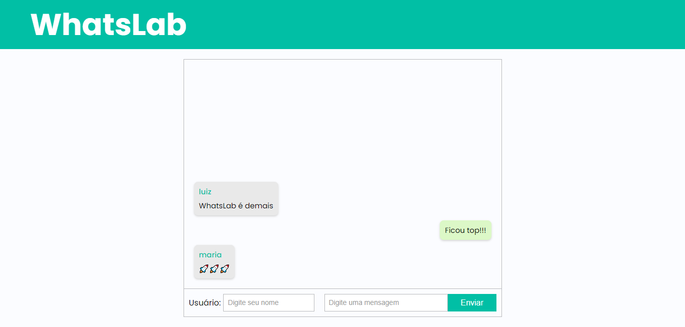

# WhatsLab

WhatsLab simula uma aplicação de chat, desenvolvido para prática de renderização de listas, estados, componentes e props em ReactJS.

## Link Surge

[WhatsLab]()

## O que Funciona

- Envio de mensagens
- Apagar mensagem com duplo clique
- Responsividade

## Integrantes

- Luiz Gustavo Santos
- Nathan Medeiros
